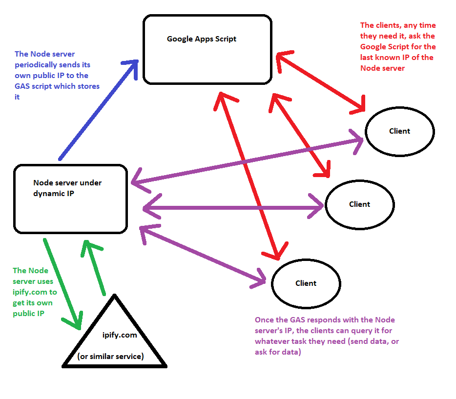

This is an alpha version of the readme just to give an idea of what this tool is supposed to do. It will be polished later on if the project becomes more functional for people other than myself ^^

# What is this project for?

**Very simply put:** the idea is to allow hosting a server under a dynamic IP connection. The script for Google Apps Script offers a static url where the server can periodically send its own IP and the clients can request the last known IP of the server.

# Structure:

###The tool is composed of 3 parts meant to work simultaneously.

**Part 1 - The Google Apps Script part (GAS):**
This runs as a Google Script hosted on a user's Google Drive. At the time of writing the service is free and runs the JS V8 engine. It provides and extensive API that allows users to use JS scripts to interact with the Google services in many ways (https://developers.google.com/apps-script/reference).

The script is a "Web App" (https://developers.google.com/apps-script/guides/web). It takes advantage of the GET and POST methods the API provides, using a Google Sheet as a database for persistent data, which is simple but quite effective. Once deployed, the script provides a static URL that the rest of this project can rely on to work around the problem of having the actual Node server running on a machine connected to the Internet under a dynamic IP ISP.

The POST method can:
- accept updates by the Node server and store the IP it receives.
- accept requests by the client app and provide it with the last known IP it got from the server, so that the app can then query the Node server under the dynamic IP.

**Part 2 - The Node server:**
The server, whatever its purpose may be, runs an instance of ipHermes (temporary name for the class?) as a "beacon". Once started, it periodically pings ipify.com to get its own public IP and sends it to the GAS script, so that it can save the current IP of the server.

**Part 3 - The client(s):**
The client app, whatever the actual app is, runs an instance of ipHermes as a "client"/"requester". It polls the GAS script, asking for the last known IP of the server. Once GAS responds, the app can query the actual Node server and do whatever it has to, as if it was under a static IP/domain name.

TODO: write this properly with installation guide and everything.

